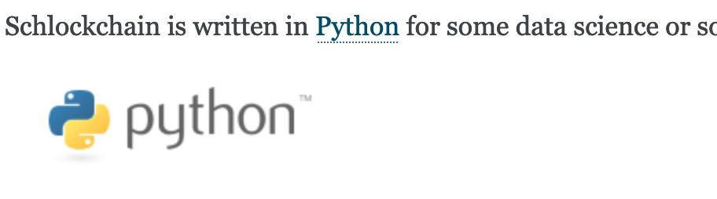

# This is the index.md!
## Hello, Sphinx Markdown!
### title 3
#### title 4

```{toctree}
:maxdepth: 1
:caption: "Contents:"

page1
```

```c
void func1(void)
{
    return;
}
```

Investors say the best things about us:

> I'm so glad I put my life savings in Schlockchain.
>
> > Said Nobody Ever


We have a patented algorithm:

- Glacially slow
- Which melts glaciers

...and a roadmap to success:

1. Start an LLC
2. Get a Series A investment round
3. Get a Series B investment round
4. Continue




a formula:  $y = F(x) =  \int_1^x\frac{1}{t}dt$